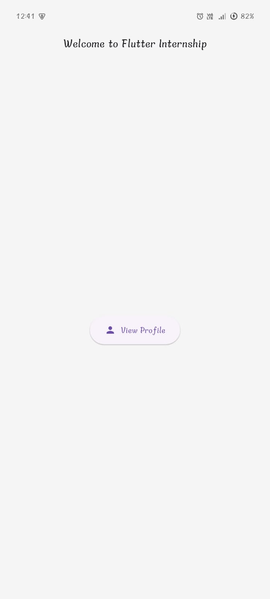
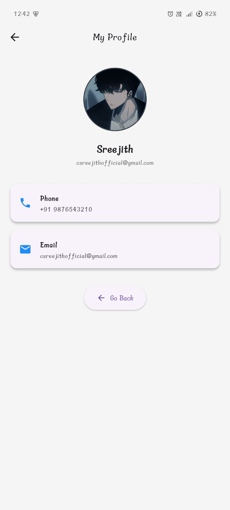

# Simple Profile App - Flutter Internship Task

A basic Flutter app that displays a user's profile using widgets and navigation. Built as part of the Flutter Internship Task by Vignesh.

## 🔹 App Features

- Home Screen with "Welcome to Flutter Internship" AppBar
- Button to view Profile
- Profile Screen with:
  - Circular profile image
  - Name, Email, Phone Number
  - "Go Back" button
- Uses Navigator.push and Navigator.pop for navigation
- Reusable custom widget: `ProfileInfoCard`
- Basic styling (padding, colors, font sizes)
- Bonus:
  - 2-second loading screen
  - Model class for profile data

## 📁 Folder Structure

```text
lib/
├── main.dart
├── screens/
│   ├── home_screen.dart
│   └── profile_screen.dart
├── widgets/
│   └── profile_info_card.dart
├── models/
│   └── profile.dart
assets/
└── images/
    └── profile.jpg

## 🚀 Getting Started

1. Clone the repo:

git clone https://github.com/0xsreejith/profile-app.git
cd flutter-profile-app

2. Get packages:

flutter pub get

3. Run the app:

flutter run

---

## 📱 App Screenshots

### 🏠 Home Screen


### 👤 Profile Screen



Made with ❤️ using Flutter.
